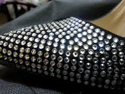

# CorelResizer

## Introducción

Este proyecto tiene como objetivo solucionar una problemática de Corel Draw acerca de cómo redimensiona un conjunto de objetos.

## Aplicación :gem:

Al realizar diseños para strass se utilizan programas de dibujo vectorizado. En el programa Corel Draw se ha detectado un problema con el redimensionado de múltiples objetos, y este problema es el siguiente: 

Si tenemos dibujados varios objetos circulares de un tamaño ss10 (3mm) y queremos cambiarlos por otros de tamaño ss06 (2mm), debemos de ir seleccionando cada uno de los objetos y redimensionarlo uno por uno, ya que no existe herramienta que tras hacer la selección de todos estos objetos cambie el tamaño de cada uno de los objetos manteniendo su posición. 

Este tipo de diseños es muy usual en sectores como el del calzado, confección, bolsos, etc... Como podremos imaginar la variedad de diseños es muy amplia, habiendo unos muy sencillos con una cantidad pequeña de cristales y otros que utilizan más de 8000. Cuando queremos hacer pruebas para ver que efecto nos hace cambiar el tamaño de los cristales en estos diseños tan complejos es cuando el trabajo que supone redimensionarlos uno por uno es muy tedioso. Por este motivo me decidí a relizar un macro que automatizara esta función, disminuyendo significativamente el tiempo en realizar el trabajo, así como la eliminación de errores por la manipulación de cada uno de los objetos.

### Capturas de Pantalla

#### Formulario selección tamaño

#### Formulario combinación

## Tecnologías Utilizadas :hammer_and_wrench:

- **Visual Basic**: Lenguaje de programación utilizado para el desarrollo del macro para la aplicación.
- **Corel Draw**: Programa de diseño vectorizado donde vamos a utilizar el macro programado.

## Versiones :pushpin:

Esta macro ha sido probada en corelDraw X6, X8,

## Licencia :page_with_curl:

Este proyecto está bajo la Licencia MIT.

## Autor

- [Fernando Maciá](https://github.com/fernandomacia)

